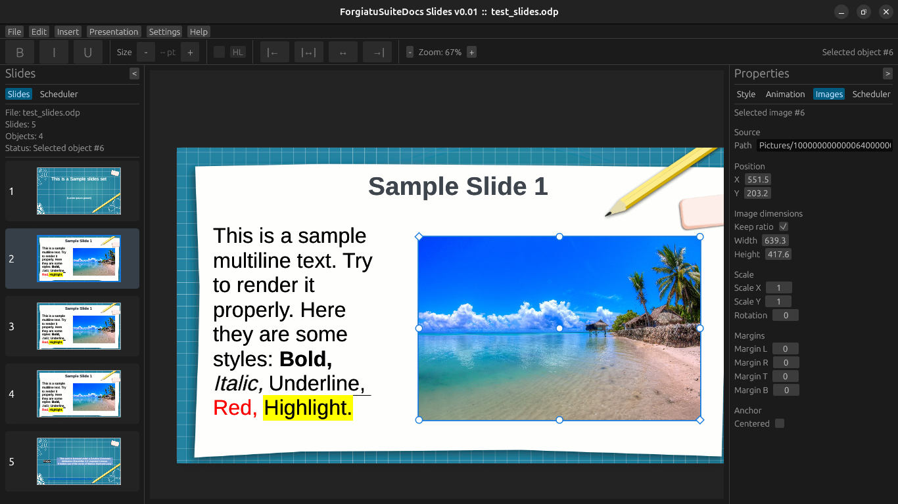

# ⚠️ ForgiatuSuiteDocs Slides ⚠️ (WARNING: Vibe Coded Project)

**ForgiatuSuiteDocs** is a ODP (Open Document Presentation format) text editor, which has been vibe coded in the spare time with Codex. But not gonna lie, I wouldn't define it a "project" at this stage, because it barely exists...

## ⚠️ DISCLAIMER!!! ⚠️

This project has been built from scratch in Rust and it is not related or endorsed in any case and in any way by more famous Open Source Office Suites.

## 🚧 Planned Features 🚧 

- [x] Open and read 'odp' presentation files  
- [x] First minimal save/save-as for 'odp' files, preserving supported text and image frames  
- [x] Print to File (PDF)
- [x] Basic slide rendering  
- [x] Add and edit text elements  
- [x] Insert and resize images  
- [ ] Basic bullet and numbered lists  
- [ ] Keyboard shortcuts for productivity  
- [x] Fast and lightweight (written in Rust 🦀)  
- [x] Text formatting (font, size, color, bold, italic, etc.)  
- [ ] Slide layouts (title, content, two-column, etc.)  
- [ ] Shape insertion (rectangles, arrows, etc.)  
- [ ] Object alignment and positioning tools  
- [ ] Themes and basic styling  
- [ ] Undo / Redo functionality  
- [ ] Slide transitions  
- [x] Animations for elements  
- [ ] Master slide support  
- [ ] Notes view (speaker notes)  
- [ ] Slide duplication and reordering  
- [x] Export to PDF  
- [ ] Real-time collaboration  
- [ ] Cloud sync integration  
- [x] Presenter mode  
- [ ] Native printing (Linux)
- [ ] Spell checking and grammar suggestions  

Stay Tuned!
